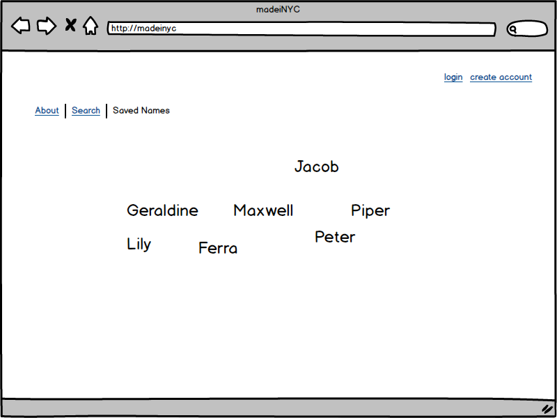
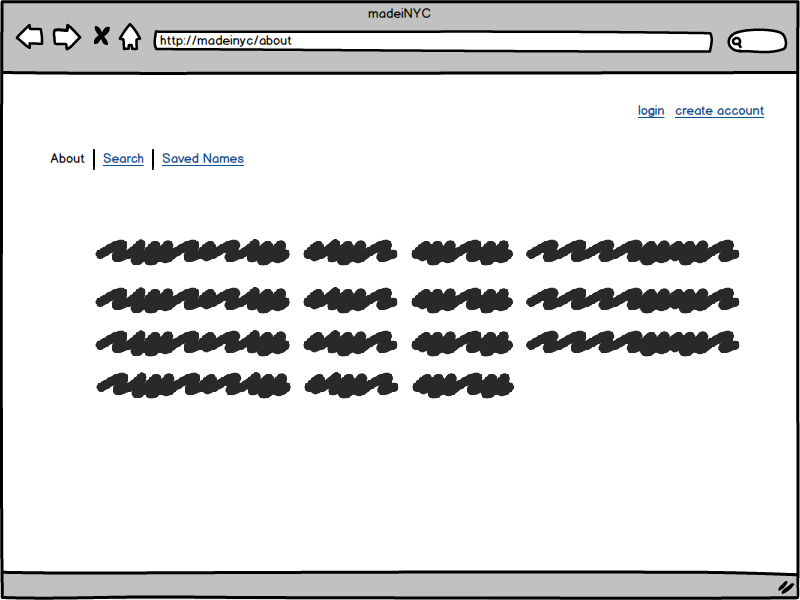
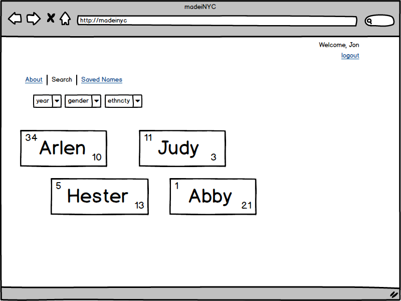

# MadeiNYC

MadeiNYC queries the most popular baby names in New York City from the years 2011-2014 using the NYC Open Data SODA API.  The results provide the name's rank /count and can be queried by year, sex, and ethnicity. 

##Technologies
Node.js, Mongo, Javascript, JQUERY

##User Stories

A Viewer should be able to register to the site as a new user

A User should be able to login and logout of the site

A User should be able to query query the popular baby names by gender, ethnicity, and year.

A User should be able to save babynames they like onto a list

##next steps

A viewer not be able to search

A user should be able to have a collection names associated to their account

A user should be able to see a randomized collection of names based on their query

A user should be able to see some etymological characteristics of the name before they save 

(consider cross referencing to second api http://www.behindthename.com/api/)
